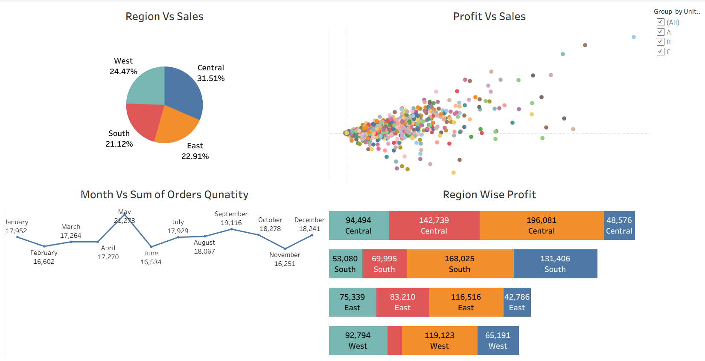

# 📊 Sales Dashboard using Tableau

## Overview

This Tableau dashboard analyzes sales performance across different regions.

## Dataset

- Excel Dataset
- Orders.xlsx

## Dashboard Features

- Region vs Sales
- Profit vs Sales
- Monthly Order Quantity
- Region-wise Profit
- Interactive Filters

## Tools Used

- Tableau
- Microsoft Excel

## Dashboard Preview

## Insights

- Central region contributes the highest sales.
- South region contributes the lowest sales.
- May has the highest order quantity.
- Profit increases with higher sales.

## Files

Dashboard/
- Sales_Dashboard.twbx

Data/
- Orders.xlsx